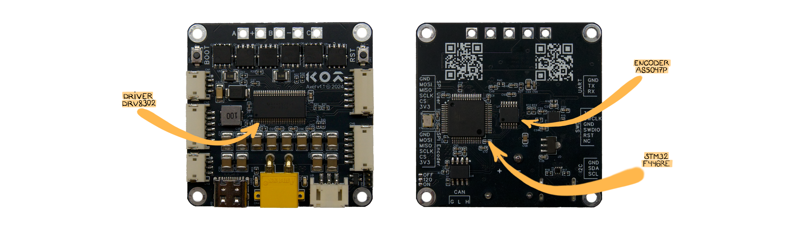
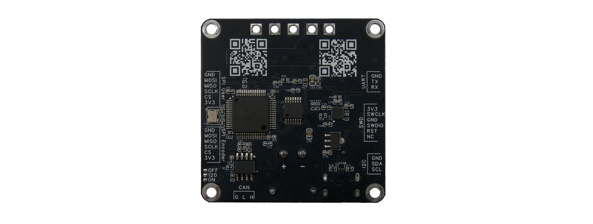

# Axel Hardware Overview

Axel is designed as a versatile, high-performance open-source BLDC motor controller. This document details the core hardware components and interfaces that make Axel a powerful and flexible solution for motor control applications.

---

## ⚙️ Key Components

Axel integrates carefully selected components to achieve high efficiency, precision, and versatility:

- **Microcontroller:** STM32F446RE  
  - 180MHz Cortex-M4F MCU with DSP and floating-point unit.
  - Rich set of peripherals suitable for motor control applications.
  - High computational performance optimal for even most demanding applications.

- **Motor Driver:** TI DRV8302  
  - Three-phase gate driver for BLDC motors for high-power applications
  - Supports a wide operating voltage range of **8V to 60V**.
  - Integrated overcurrent protection.

- **Encoder:** AS5047P  
  - High-resolution **14-bit rotary position sensor**.
  - Capable of high-speed angular measurement over **360 degrees**.
  - Dynamic angle error compensation for precise feedback in high-speed motor control.

---

## 🔌 Interfaces

Axel is equipped with multiple communication and control interfaces to ensure maximum compatibility with various applications:

### **Communication Interfaces**
- **x2 SPI (Serial Peripheral Interface)**  
  - High-speed communication with external encoders and sensors.
  - Can be used as a control bus in specific applications.

- **x1 I2C (Inter-Integrated Circuit)**  
  - Suitable for low-speed sensor interfacing (e.g., thermistors, IMUs, environmental monitors).

- **x1 CAN FD (Controller Area Network - Flexible Data Rate)**  
  - Robust, high-speed communication standard for distributed control systems.
  - Ideal for applications in robotics, automotive, and industrial automation.

- **x1 UART (Universal Asynchronous Receiver-Transmitter)**  
  - Commonly used for debugging, calibration, and interfacing with external modules.

- **x1 USB Type-C**  
  - High-speed data exchange.
  - Supports debugging, DFU (Device Firmware Upgrade) flashing, and serial communication.

### **Programming Interfaces**
- **SWD (Serial Wire Debug)**  
  - Standard ARM debugging interface.
  - Used for firmware development and real-time debugging.

- **DFU (Device Firmware Upgrade)**  
  - Enables firmware flashing over USB without external programmers.

---

## 🏗️ Future Enhancements
We continuously improve Axel’s hardware and software ecosystem. If you have suggestions or need additional technical details, feel free to contribute or reach out to the team.

For more information on contributing and getting involved, please refer to **[CONTRIBUTING.md](../CONTRIBUTING.md)**.

---

**Axel – Your open-source platform for powerful and flexible BLDC motor control!**

